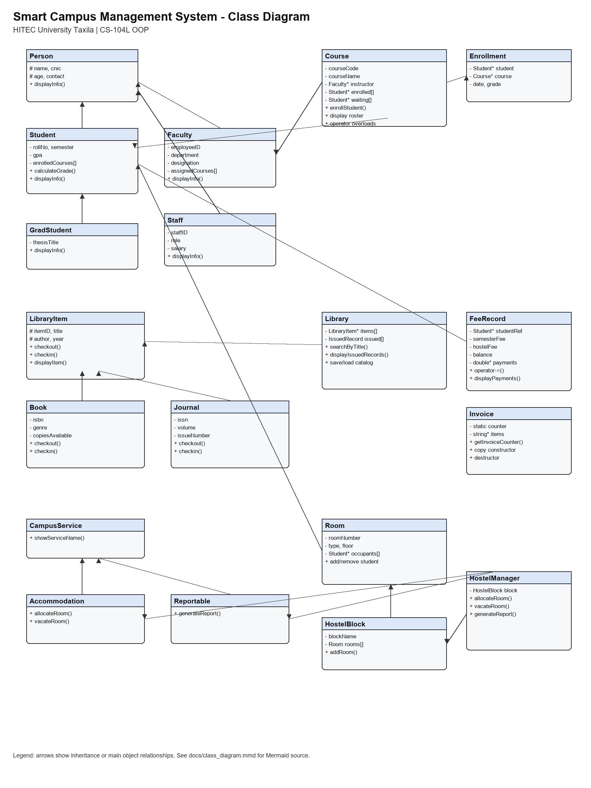

# Smart Campus Management System (SCMS)

## Project Info
- Group Members:
  - Ahmad Ali | Reg No: 25-CS-067
  - Umer Altaf | Reg No: 25-CS-057
  - Muhammed Ahmad | Reg No: 25-CS-252
- Course: CS-104L Object-Oriented Programming
- University: HITEC University Taxila

Note: The project brief mentions individual/team of 2. Confirm with the instructor if a 3-member group is allowed.

## Project Description
Smart Campus Management System is a simple C++ console project for basic university work.
It manages students, faculty, courses, library records, fee records, hostel rooms, and reports.
The program is divided into six modules so each OOP concept is easy to find and explain.
It uses classes, inheritance, polymorphism, arrays, file handling, exception handling, operator overloading, and copy semantics.
The interface is menu-based and runs in the command prompt.

## Current Status
This folder contains the completed simple command-line version of the SCMS project. It includes all main assignment modules:

- Person hierarchy: `Person`, `Student`, `GradStudent`, `Faculty`, `Staff`
- Course and enrollment management: `Course`, `Enrollment`
- Basic exception handling with `CapacityExceededException`
- Library module: `LibraryItem`, `Book`, `Journal`, `Library`
- Finance module: `FeeRecord`, `Invoice`
- Hostel module: `Accommodation`, `Reportable`, `Room`, `HostelBlock`, `HostelManager`
- Reports module: `Reports` and `Utils`
- Simple arrays, constructors, getters/setters, inheritance, polymorphism, file handling, and operator overloading
- Clean console interface with separate module screens and `0. Back to Home` options

You should still personalize and review the project before submission:

- Replace sample names, CNICs, fees, and roll numbers with your own values
- Review `docs/class_diagram.png`
- Review `docs/project_report.pdf` and replace screenshots only if your teacher wants manual terminal screenshots
- Make sure every group member can explain the files used in their module

## Modules

1. Person Hierarchy: `Person`, `Student`, `GradStudent`, `Faculty`, and `Staff`.
2. Course and Enrollment: `Course` and `Enrollment` with capacity checks and overloaded operators.
3. Library System: `LibraryItem`, `Book`, `Journal`, and `Library` with file loading/saving.
4. Fee and Finance: `FeeRecord` and `Invoice` with deep copy, static counter, and payment operator.
5. Hostel Management: `Room`, `HostelBlock`, and `HostelManager` with multiple inheritance and composition.
6. Reports and Utilities: `Reports` and `Utils` for sorting, searching, formatting, text reports, and PDF-style text reports.

## How to Compile

### Windows PowerShell with g++
```powershell
.\build.bat
.\scms.exe
```

Or:

```powershell
.\run.bat
```

### Windows PowerShell with the included D: drive compiler
```powershell
$env:PATH = "D:\tools\w64devkit\bin;$env:PATH"
.\build.bat
.\scms.exe
```

### Linux or GitHub Actions style
```bash
g++ -std=c++17 -Wall -Wextra src/main.cpp src/person/*.cpp src/course/*.cpp src/library/*.cpp src/finance/*.cpp src/hostel/*.cpp src/utils/*.cpp -o scms
./scms
```

## OOP Concepts Already Demonstrated

1. Classes and objects: all C++ classes in `src/`
2. Encapsulation: private data with public getters and setters
3. Constructors: default and parameterized constructors
4. Copy constructor: `Person` and `Course`
5. Single inheritance: `Student : Person`
6. Multi-level inheritance: `GradStudent : Student : Person`
7. Abstract class: `Person`
8. Pure virtual function: `displayInfo()`
9. Runtime polymorphism: `Person* people[]` in `main.cpp`
10. Operator overloading: `Course ==`, `Course <<`, `Course +`
11. Friend function: `operator<<` for `Course`
12. Custom exception: `CapacityExceededException`
13. Aggregation: `Course` stores a `Faculty*`
14. Array-based collections: course arrays, people arrays, library arrays, hostel room arrays
15. File I/O: `Library::saveCatalog`, `Library::loadCatalog`, campus text report
16. Static members: `Invoice::invoiceCounter`
17. Copy assignment: `FeeRecord` and `Invoice`
18. Multiple inheritance: `HostelManager`
19. Virtual inheritance: `Accommodation` and `Reportable`
20. Composition: `HostelManager` contains `HostelBlock`
21. Search functions: `Library::searchByTitle`, `Library::searchByID`, `Reports::findStudentByRollNo`
22. Arrays of objects: `HostelBlock` stores `Room rooms[]`
23. Memory management: `Library`, `FeeRecord`, and `Invoice` use `new/delete` or `new[]/delete[]`
24. Sorting and searching: `Reports::sortStudentsByGPA` uses `std::sort`, and roll number search uses `std::find_if`
25. Reporting and utilities: `Reports.h/.cpp` and `Utils.h/.cpp`

## UML Class Diagram



## GitHub Repository

Add the public GitHub URL here after pushing:

```text
https://github.com/[username]/HITEC-OOP-SCMS-25-CS-067
```

After pushing, this command can update the README and regenerate the PDF report with your real URL:

```powershell
python tools\finalize_github_url.py https://github.com/YOUR_USERNAME/HITEC-OOP-SCMS-25-CS-067
```

## Remaining Work Checklist

- Confirm with the instructor that a 3-member group is allowed
- Replace sample CNIC/contact values with real or acceptable demo values
- Review the generated screenshots in `docs/screenshots`
- Create a public GitHub repository and push the project
- Follow `docs/manual_test_plan.md` once more before final submission

## Interface Flow

The home menu opens each module separately. Inside a module, select the task you want, then use `0` to go back home. This keeps the output cleaner instead of printing the home menu directly under every result.

## Documentation Files

- `docs/project_documentation.md`: project overview and module explanation
- `docs/module1_status.md`: Person hierarchy completion status
- `docs/module2_status.md`: Course and Enrollment completion status
- `docs/module3_status.md`: Library System completion status
- `docs/module4_status.md`: Fee and Finance completion status
- `docs/module5_status.md`: Hostel Management completion status
- `docs/module6_status.md`: Reporting and Utilities completion status
- `docs/oop_concepts_checklist.md`: where each OOP concept is used
- `docs/viva_questions_full.md`: viva questions and short answers
- `docs/phase2_status.md`: Library and Finance phase status
- `docs/manual_test_plan.md`: manual testing steps
- `docs/testing_log.md`: latest test evidence
- `docs/remaining_work.md`: what is left before final submission
- `docs/submission_audit.md`: final local readiness audit
- `docs/github_submission_steps.md`: exact steps to push the project to GitHub
- `docs/test_outputs/`: captured console output for each module
- `docs/screenshots/`: screenshot-style images generated from console output
- `docs/class_diagram.mmd`: class diagram source
- `docs/class_diagram.png`: generated class diagram image
- `docs/project_report.pdf`: generated report draft
- `tools/finalize_github_url.py`: helper to insert the final GitHub URL into README/report

## Important
Do not submit this project without understanding it. Your viva will test whether you can explain and modify your own code.
